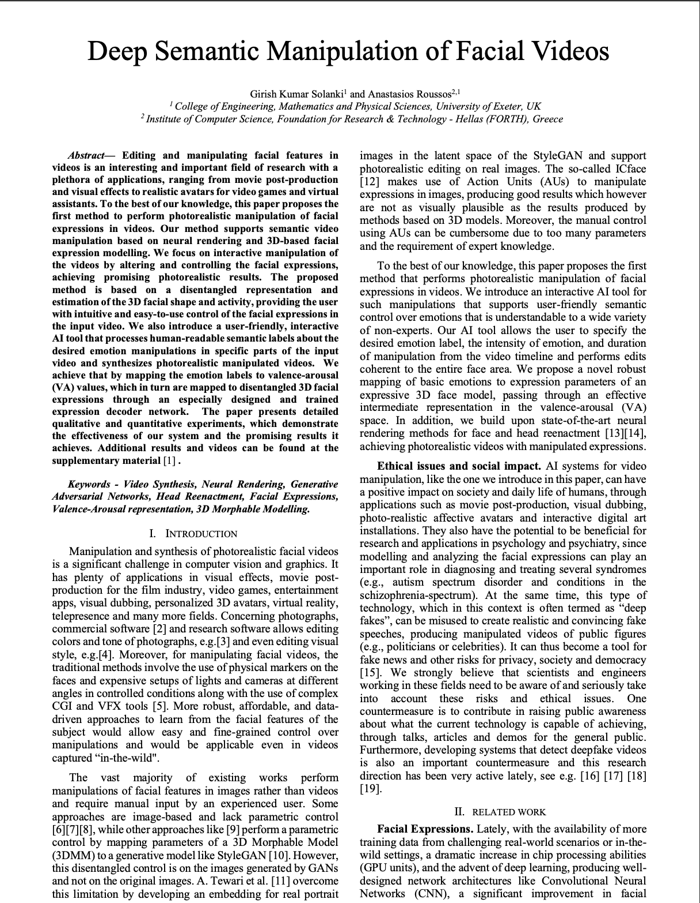
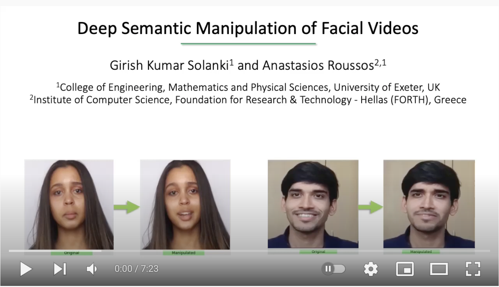

Updates under progress..

# Deep Semantic Manipulation of Facial Videos

 

Girish Kumar Solanki1, Anastasios Roussos1,2

1College of Engineering, Mathematics and Physical Sciences, University of Exeter, UK 
2Institute of Computer Science (ICS), Foundation for Research & Technology - Hellas (FORTH), Greece 

 

<blockquote>

Editing and manipulating facial features in videos is an interesting and important field of research with a plethora of applications, ranging from movie post-production and visual effects to realistic avatars for video games and virtual assistants. To the best of our knowledge, this paper proposes the first method to perform photorealistic manipulation of facial expressions in videos. Our method supports semantic video manipulation based on neural rendering and 3D-based facial expression modelling. We focus on interactive manipulation of the videos by altering and controlling the facial expressions, achieving promising photorealistic results. The proposed method is based on a disentangled representation and estimation of the 3D facial shape and activity, providing the user with intuitive and easy-to-use control of the facial expressions in the input video. We also introduce a user-friendly, interactive AI tool that processes human-readable semantic labels about the desired emotion manipulations in specific parts of the input video and synthesizes photorealistic manipulated videos. We achieve that by mapping the emotion labels to valence-arousal (VA) values, which in turn are mapped to disentangled 3D facial expressions through an especially designed and trained expression decoder network. The paper presents detailed qualitative and quantitative experiments, which demonstrate the effectiveness of our system and the promising results it achieves. Additional results and videos can be found at the supplementary material as below.

</blockquote>
 
 
 

<b>Links</b>
  

 
<a href="https://arxiv.org/abs/2111.07902">Paper</a>
  

<b>Results Video</b>
  

